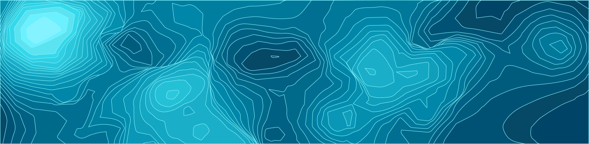

<!--  -->
# Fundamentos de los Sistemas de Información Geográfica
En esta sección revisaremos brevemente los conceptos más importantes de los Sistemas de Información Geográfica (SIG). Si deseas profundizar acerca de este tema, puedes revisar el [Libro de Sistemas de Información Geográfica](https://volaya.github.io/libro-sig/) de Víctor Olaya, del cúal se ha tomado información que forma parte de esta sección.

## Contenidos
* [Fundamentos cartográficos y geodésicos]
* [¿Qué es un SIG?](#¿Qué es un SIG?)
* [¿Qué no es un SIG?](#¿Qué no es un SIG?)
* [Componentes de un SIG](#Componentes de un SIG)
* [Proyecciones cartográficas]
	- [Tipos de proyecciones]
	- [Proyección Universal Transversal de Mercator (UTM)]
* [Sistemas de coordenadas]
	- [Sistema geográfico]
	- [Sistema de coordenadas proyectadas]  

## Fundamentos cartográficos y geodésicos

Trabajar con información georreferenciada requiere conocer una serie de conceptos previos necesarios para poder realizar correctamente todo tipo de operaciones. Estos conceptos no son exclusivos del ámbito de los SIG, sino que derivan de otras disciplinas que tradicionalmente han trabajado con este tipo de información, como por el ejemplo la cartografía.

## ¿Qué es un SIG?

Básicamente, un SIG ha de permitir la realización las siguientes operaciones:

* Lectura, edición, almacenamiento y, en términos generales, gestión de datos espaciales.
* Análisis de dichos datos. Esto puede incluir desde consultas sencillas a la elaboración de complejos modelos, y puede llevarse a cabo tanto sobre la componente espacial de los datos (la localización de cada valor o elemento) como sobre la componente temática (el valor o el elemento en sí).
* Generación de resultados tales como mapas, informes, gráficos, etc.

## ¿Qué no es un SIG?
Dos son las principales soluciones que deben conocerse por su relación directa con el ámbito SIG: Diseño Asistido por Ordenador (CAD) y AM/FM.

Principales diferencias entre SIG y CAD:

* SIG y CAD han sido diseñados para propósitos diferentes. El del SIG es reflejar la realidad, mientras que el del CAD es diseñar algo que no existe todavía. La creación es el elemento fundamental en el CAD, mientras que el estudio de una realidad ya creada constituye la base del SIG.
* El almacenamiento de datos es diferente debido al distinto enfoque. En los SIG se da mayor peso a la gestión de los datos, mientras que en el CAD la parte visual es preponderante, y el almacenamiento así lo refleja. Un dato SIG se almacena como un dato geográfico complejo, mientras que en un CAD se almacena básicamente como un «dibujo», pues es ese el enfoque fundamental de trabajo.
* El volumen de datos en un SIG es ordenes de magnitud mayor, y ello implica una gestión de datos distinta y unas necesidades más elevadas en ese sentido. La escala de trabajo también alcanza dimensiones mayores, ya que, mientras que con ambas herramientas puede trabajarse en una extensión limitada, un CAD no esta pensado para gestionar datos de una superficie como la de un país, un continente o el planeta entero.
* No todos los tipos de datos de un SIG se pueden incorporar en un CAD. Los datos procedentes de la teledetección, por ejemplo, no forman parte del abanico de datos que un CAD puede manejar.

El CAD puede resultar suficiente para desarrollar algunas tareas propias de los SIG, en particular las relacionadas con el diseño cartográfico. No obstante, algunas circunstancias ponen de manifiesto las carencias de una herramienta CAD para sustituir completamente a un SIG, al tener requerimientos para los que esta no puede ofrecer una solución. Entre estos requerimientos cabe citar los siguientes:

* Análisis, modelización, y gestión avanzada de datos espaciales.
* Trabajo con datos que cubren una gran superficie geográfica. Necesidad de utilizar diversos sistemas de proyección.
* Edición de datos por usuarios de distinto perfil y de modo concurrente.

## Bibliografía