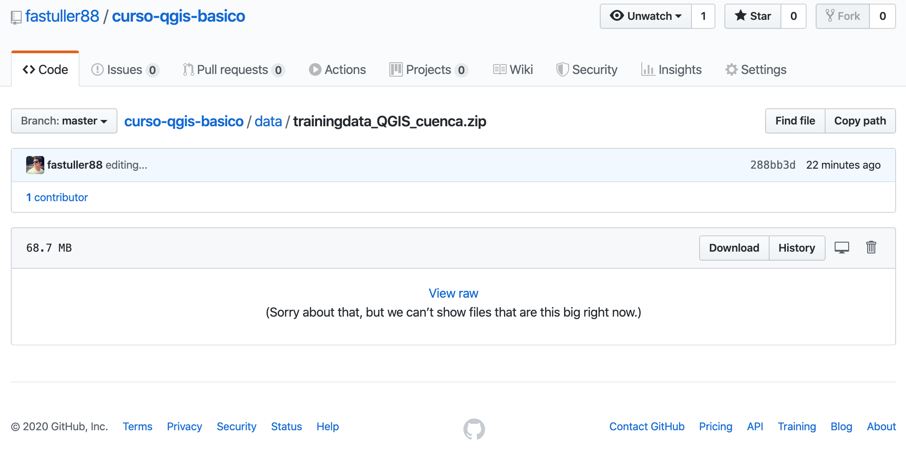

# La interfaz de QGIS
En esta sección te familiarizaras con la interfaz que nos presenta QGIS. Después de completar ésta sección, serás capaz de identificar correctamente los elementos básicos de la pantalla de QGIS y sabrás qué hace cada uno, y cargar un shapefile dentro de QGIS.

> Advertencia: Este curso incluye instrucciones para añadir, borrar y alterar bases de datos del SIG. Hemos proporcionado bases de datos de entrenamiento para éste propósito. Antes de usar técnicas descritas aquí en tus propios datos, siempre asegúrate de que tienes los backups adecuados!

## Contenidos

* [¿Por qué QGIS?](#por-qué-qgis)
* [Añadiendo tu primera capa](#añadiendo-tu-primera-capa)

## ¿Por qué QGIS?
Como la información se vuelve cada vez más espacialmente consciente, no hay escasez de herramientas capaces de satisfacer algunas o incluso todas las funciones utilizadas en SIG. ¿Por qué debería uno utilizar QGIS en lugar de otros paquetes de software de GIS?.

Aquí hay solo algunas de las razones:

* **Es gratis**. Instalando y utilizando QGIS te cuesta la total cantidad de cero dinero. Sin cuota inicial, ni cargo fijo, nada.
* **Es libre**. Si necesitas más funciones en QGIS, puedes hacer más que esperar a que sean incluidas en la siguiente versión. Puedes patrocinar el desarrollo de la función, o añadirla tú mismo si estás familiarizado con programación.
* **Está en constante desarrollo**. Porque cualquiera puede añadir nuevas funciones y mejorar las ya existentes, QGIS nunca se estanca. El desarrollo de una nueva herramienta puede ocurrir tan rápidamente como tu lo necesitas.
* **Extensa ayuda y documentación está disponible**. Si te estancas con cualquier cosa, puedes ayudarte con la extensa documentación, tus compañeros de QGIS, o incluso en los promotores.
* **Multiplataforma**. QGIS puede ser instalado en MacOS, Windows y Linux.

## Añadiendo tu primera capa 

> Nota: Antes de comenzar este ejercicio, QGIS debe estar instalado en su computadora.
> Descarga un archivo comprimido con los datos para éste curso haciendo click en el siguiente enlace: [trainingdata_QGIS_cuenca](/data/trainingdata_QGIS_cuenca.zip)
> 
> 
> 
> 
<!-- > https://github.com/fastuller88/curso-qgis-basico/raw/master/data/trainingdata_QGIS_cuenca.zip -->