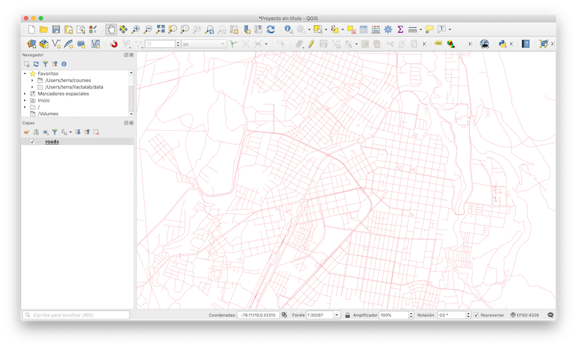
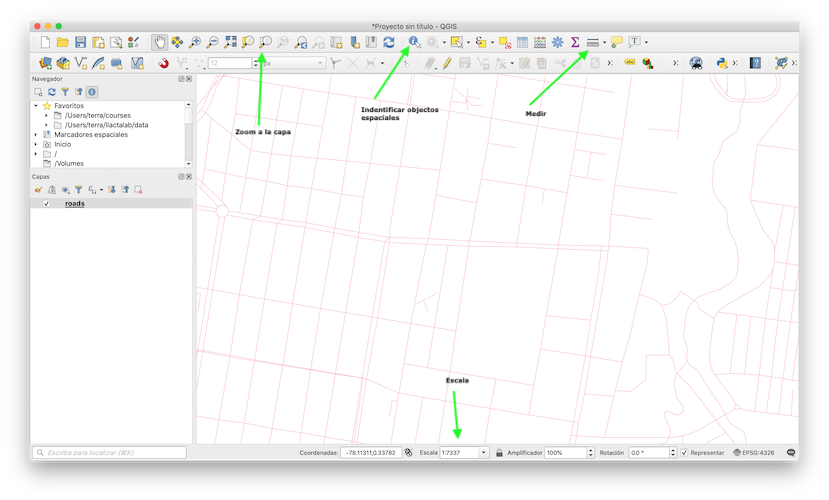

# Hoja de respuestas

* [Resultados para Añadiendo Tu Primera Capa](#resultados-para-añadiendo-tu-primera-capa)
* [Resultados para un resumen de la interfaz](#resultados-para-un-resumen-de-la-interfaz)

## Resultados para Añadiendo Tu Primera Capa

Deberías ver muchas líneas que representan carreteras. Todas estas líneas están en la capa vectorial que acabas de cargar para crear el mapa básico.

## Resultados para un resumen de la interfaz

Es posbible que los elementos no esten en el mismo orden pero si en los mismos paneles o barras de herramientas.

